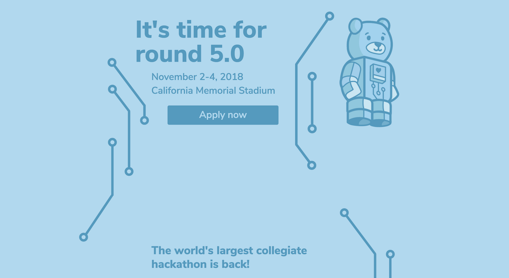

The <a href="https://2018.calhacks.io" target="_blank" class="matcha">landing page for Cal Hacks 5.0</a>
is the entry point to Cal Hacks's in-house hacker application portal, sponsor information, live scheduling site, and more. I centered the design and implementation around a floaty circuited theme.

5.0 is the first time in Cal Hacks' five-year history that we've had a full-fledged application portal. As such, it's a significant milestone in our history and allows for a much more robust backend system than our prior combinations of Typeforms and internal app-reading systems/
