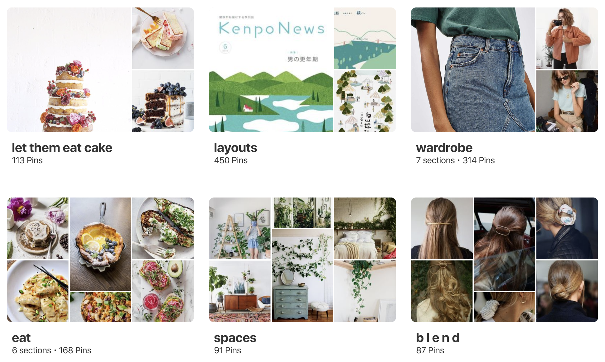

As a designer studying mathematics, I'm passionate about unearthing the aesthetic implications of deeply conceptual entities to create empowering and accessible interfaces. Mathematics enables reasoning about intangible mental structures, and then reduces them to a set of logic. To me design is a form of mathematics. Combining my mathematical and visual intuitions well-positions me to reason about complex systems and resolve these complexities through logical visual interfaces.

<a href="https://pinterest.com/adrianababakanian" target="_blank" class="matcha">Pinterest</a> is my favorite product, and ring & category theory some of my favorite areas of mathematics. These favoritisms are not at all arbitrary &mdash; my interface and mathematical preferences are both defined by organizing conceptual complexity through visual logic. This project, informed by my belief that design is a form of mathematics, utilizes the
<a href="https://developers.pinterest.com/docs/getting-started/introduction/?" target="_blank" class="matcha">Pinterest API</a> to map Pinterest boards to elements of and morphisms between category-theoretical mathematical structures.

## Motivation
My applied mathematical lens is constantly finding mathematical structures in the world around me &mdash; especially when it comes to visual structures. To me isomorphisms exist between mathematical concepts and visual interfaces.

I use Pinterest to gather inspiration and reason about my own cognitive systems on nothing less than a daily basis. When taking my first course in abstract algebra, I began to notice the similarities between algebraic structures and the way in which I use Pinterest to structure my visual inspirations. Below I document the mathematical and visual intuitions that guided this project.

## Mathematical Intuition
Mathematics is the study of truth. I find mathematics to be so beautiful because of it's truly breathtaking power to create rigorously defined structures by creating morphisms on seemingly meaningless sets of data.

I'll provide a brief background on the mathematical intuitions that informed my ideation of this project before going into the technical implementation.

Ring theory is the study of rings &mdash; algebraic structures defined by a set on which two binary operations, addition and multiplication, exist. These operations take two elements of the ring and map them to another element also within the ring. Rings have an array of properties interesting in both theory and application, from ideal theory to the underpinnings of the public key cryptography that our data privacy rests upon. Morphisms exist both within and between rings, creating relationships grounded in mathematical logic.

Ideals are special subsets of rings intuitively categorized by their ability to absorb multiplication by elements of the larger ring space. That is, an ideal is an additive subgroup of the ring whose elements map to elements of the ideal when multiplied by any element of the larger ring.

I find ideals so fascinating particularly because they absorb and maintain their identity even when augmented. For a more grounded example, consider the even integers. They form an ideal of the ring of integers &mdash; multiplying an even integer by any other integer results in yet another even integer. This intuition can be expanded to far more complicated mathematical spaces and result in fascinating structures.

## Visual Translation
I decided to look at my boards on Pinterest through the lens of ring theory &mdash; that is, looking at each board as an ideal in the ring of my visual interests, and analyzing how I could define mathematical relations on my visual intuitions such that the properties of an ideal would be satisfied. I'm currently working on defining the operations on my different boards and then using these morphisms to pull in data from Pinterest's APIs.

That is, my goal is to use mathematics to predictively augment my sources of visual inspiration.

This project is a work in progress, but I'm excited to see where it takes me next as a mathematically-informed designer.
