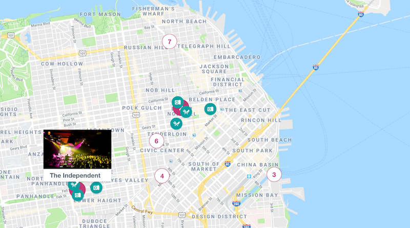

<a href="https://www.stubhub.com/" target="_blank" class="matcha">StubHub</a>
is the world's largest secondary ticketing marketplace &mdash; but most people only visit the site to buy a ticket they already know they want. Experiences that enable event discovery are lacking in the industry. Since event-going is often an end-to-end experience that entails more than just the event itself, I and a small team of interns in design, user research, product management, and SEO took on the task of creating a single page for event and venue discovery richly enhanced by external data and filtering functionalities.

Our team framed our design, research, and development around the following question: How might we enable users to discover inspiring event experiences in a particular city?

## Technologies

I implemented the city page in React. I also made extensive use of external APIs, primarily
<a href="https://developers.google.com/maps/documentation/javascript/tutorial" target="_blank" class="matcha">Google Maps</a> and
<a href="https://developers.google.com/places/web-service/intro" target="_blank" class="matcha">Google Places</a>.

## User Research
Several rounds of user testing were performed throughout the summer, including guerilla testing, formalized research in a usability lab, targeted testing, and more. Most notably, we constructed testing to understand the user needs and desired interface layout by creating components, cutting them out, and giving the interviewees complete freedom to construct an interface that would allow them to optimally explore a city in which they'd like to attend an event.

Some interesting results included the differences & similarities between interfacing with a city as a local versus a tourist, the desired prominence of particular features on the map, and certain filtering functionalities. Since I'm under NDA, please reach out if you'd like more details.

## Takeaways
This project gave me the opportunity to develop a complex application within a large, existing codebase revolving around a very modern web development framework. I was entrusted with a lot of responsibility as the sole developer on the project. As such, I gained both programmatic maturity as well as team-based leadership skills.

The final product was particularly rewarding for me given my fascination with mapping interfaces &mdash; it was a vessel for me to both gain technical expertise with the relevant datasets and make design decisions based on user interactions with geospatial data.
