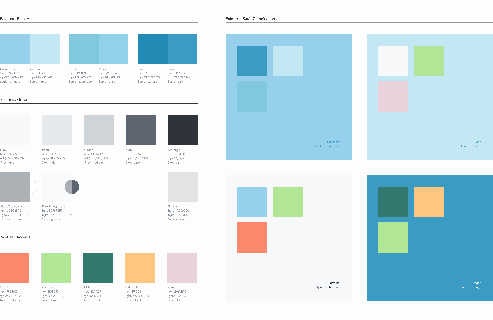
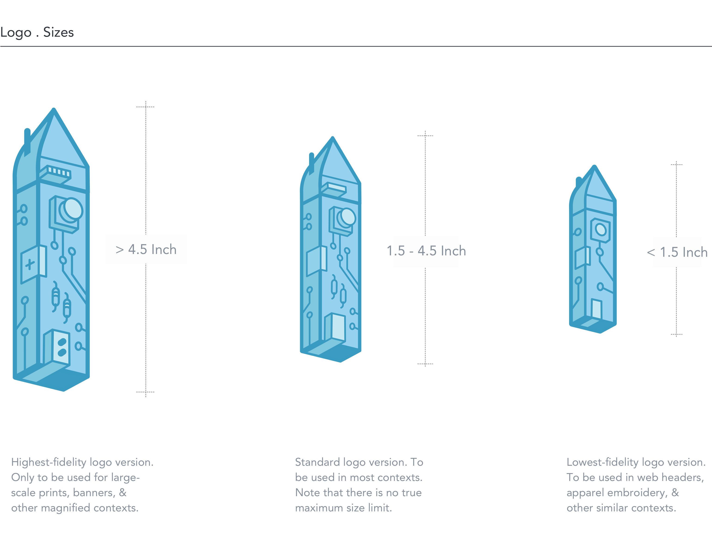

<a href="https://calhacks.io" class="cycle">Cal Hacks</a> is a nonprofit organization composed of students passionate about fostering a culture of hacking, entrepreneurship, and social good via the empowerment of technology. Our claim to fame is throwing the world’s largest collegiate hackathon every fall. As our team’s designer, I utilize design as a tool for progressing our team's initiatives and the causes that inspire me.

A cohesive visual identity defines the voice of an organization. The Cal Hacks brand was previously defined by annual designs corresponding to each hackathon iteration. As we’ve matured from a startup-like environment into an established organization, our influence in the realm of technology extends beyond the space of hackathons into <a href="https://calhacks.io#initiatives" class="cycle">entrepreneurship</a>, <a href="https://calhacks.io#initiatives" class="cycle">diversity</a>, <a href="https://calhacks.io#initiatives" class="cycle">inclusivity</a>, <a href="https://calhacks.io#initiatives" class="cycle">and beyond</a> — thus rendering a cohesive branding identity crucial.

## Brainstorming
The process for this rebrand was guided by my desire to communicate illustratively the defining aspects of Cal Hacks — namely our grounding in technology as a means of empowerment and our proud roots at <a href="https://berkeley.edu" class="cycle">UC Berkeley</a>.  

I started off by taking inspiration from rather generic computer science-related topics — graph structures, text editor syntax, circuitry, and the like. My first attempts at a logo involved some rather cliche attempts at writing out Cal Hacks or the initials “CH” with these geeky hacker concepts.

After these first attempts, I was unsatisfied with the lackluster two-dimensionality of the results. These flat designs visually read to me as favicons more than the dynamic logo we needed. As such, I began playing with more with illustrative concepts to lend a bit more personality than generic programmatic idioms. I mainly wanted to incorporate a Berkeley-esque element into the logo, but without convoluting the permanent logo with our iterating annual dd0ski. As such, I decided to stay away from incorporating a bear. This left me to explore arguably the most iconic architectural element of our campus — the
<a href="https://campanile.berkeley.edu/" target="_blank" class="cycle">Campanile</a>.

I toyed with the idea of creating outlines of the Campanile using nodes suggestive of both circuitry and tree-based data structures. These results still read as far too visually flat for my liking, however.

The Campanile has the added bonus of naturally lending itself to an isometric design — a great way of adding some dimensionality while still maintaining the flexible integrity of a flatter logo. At the time that I was mocking up some logo ideas, we were discussing many ways to integrate more hardware into Cal Hacks. We partner with <a href="https://mlh.io" target="_blank" class="cycle">MLH</a> to lend a wide range of hardware during the hackathon, and it is one of our goals to make this hardware more accessible to the heavily software-oriented crowd at Cal Hacks.

I drew much inspiration from <a href="https://dribbble.com/shots/2267138-Hackathon" target="_blank" class="cycle">this great Arduino-esque logo</a>, especially since I personally have a <a href="https://github.com/adrianababakanian/mo_code" target="_blank" class="cycle">good deal of experience</a> with Arduino microcontrollers and IDEs (check out my robot Mo!). My first iterations based off this logo as inspiration attempted to morph the Campanile with a flat circuit board.

I eventually narrowed the versions down to one circuit board.

The resulting shape of this structure, however, was a bit awkward for a logo — I couldn’t see it fitting with inline elements or aligning well with text. As such, I rotated the campanile 90 degrees to stand upright and altered the illustration to make it slightly more three-dimensional.

And thus we have our Hackanile — Berkeley’s beloved Campanile built out of circuitry!

## Color Palette
A cohesive color palette inherently creates a unified visual identity. My choice of predominantly blue was mostly informed by the fact that we are UC Berkeley’s hackathon, and our school’s colors are proudly blue and gold. Although I made the decision to go with some form of blue, my first few iterations utilized a wide range of blues before I narrowed in on the slightly muted, monochrome palette of blues defining the final branding.

This decision to use a monochrome palette is consistent with my motivation to rebrand Cal Hacks — monochromatic color definition inherently creates visual cohesion in the same way that a permanent brand creates image cohesion. As such, I created a monochrome blue palette defined by saturated backgrounds offseting outline-defined foregrounds.

As much as I love the unified-yet-poppy identity given by the monochrome blues, I also recognize the need to have access to more than one color in certain contexts. (<a href="https://brand.berkeley.edu/colors/" target="_blank" class="cycle">Berkeley's branding color guideline</a> does an excellent job of this, in fact.) I thus made a palette of accent colors and defined some basic combinations to inform future color palette decisions.

## Scalability & Sizing
Since this logo is permanent, I wanted to ensure that there is no context in which it can’t be used. As such, there are three different versions of the logo, each for different size contexts. Detail in the circuitry is eliminated as the logo scales down, and external padding added appropriately.

## Typography
My choice of typefaces was informed by the logo itself. I chose <a href="https://docs.microsoft.com/en-us/typography/font-list/abadi-mt-condensed#abadi-mt-condensed-extra-boldo" target="_blank" class="cycle">Abadi MT Condensed Extra Bold</a> in all-caps as our main textual logo component, as well as for headers. It’s a blocky but slender typeface that marries well with the circuited-yet-sleek build of the Hackanile, mimicking the logo’s simultaneous visual slenderness and inherent hardware.

Avenir is my personal favorite typeface (I have a soft spot for Humanist sans-serifs), but has certain limitations in web usage that makes it hard for us to utilizes as a large-scale organization. Although I use Avenir in my graphic assets, I use a combination of <a href="https://fonts.google.com/specimen/Nunito+Sans" target="_blank" class="cycle">Nunito Sans</a> and <a href="https://fonts.google.com/specimen/Muli" target="_blank" class="cycle">Muli</a> for web. Nunito Sans serves as headers and subheaders, while Muli as all the body texts.

Nunito Sans is a display typeface available in a full set of weights, with a well-balanced distribution that anchors its endpoints to the baseline well. It's for this reason that I like using it as a bolded header in a monochrome context — it maintains its integrity even in low-contrast contexts.

(Speaking of low contrast, I [conducted some user research]() to validate my color palette for accessibility. I consider this research necessary since I acknoledge that the extremely low contrast nature of the color palette can easily result in lack of readability for many users. This research allowed me to create standards for my branding in web contexts that ensure an optimal experiences for all users.)

Muli is an almost delicate, rounded, and minimalist sans serif that contrasts well with the elongated all-caps of Abadi MT Condensed. I use it for all body text.

## Standardization & UI Kit
To ensure that this brand is used as it is intended — universally and permanently! — across Cal Hacks, I developed a UI Kit for future designers and a Sass file to be used by our tech team.

I used both of these assets myself when I made the <a href="https://calhacks.io" target="_blank" class="cycle">permanent Cal Hacks site</a> and <a href="https://calhacks.io" target="_blank" class="cycle">landing page for Cal Hacks 5.0</a>, both of which you can learn more about <a href="https://calhacks.io" target="_blank" class="cycle">here</a> and <a href="https://calhacks.io" target="_blank" class="cycle">here</a>!

## Brand Extensions
The standardization of our visual image extended to my branding campaigns across our Cal Hacks initiatives. The purpose of the branding campaign is to add cohesion to our visual identity, and as such I built on the established style to create sub-logos integrated with the branding guidelines.

#### The Cal Hacks Fellowship
We rolled out our new initiative for entrepreneurial hackers, the [Cal Hacks Fellowship](https://calhacks.io/#initiatives), during Cal Hacks 4.0 and mentored our first round of Fellows throughout the following spring. I wanted to create a standalone logo for the Fellowship that would still mesh well with its parent brand. As such, I developed the logo in conjunction with our Hackanile.

My reasons for choosing a rocket were twofold — the launching of a rocket perfectly captures the spirit of ideational acceleration and incubation embraced by our fellowship, and it’s also the favorite emoji of Aakash, our fellowship program lead! I thus iterated on the rocket idea until resulting in the final version, a circuit-inspired rocketship matching in visual style with the Hackanile yet still able to serve as a logo on its own.

#### CubStart
<a href="https://calhacks.io#initiatives" target="_blank" class="cycle">CubStart</a> is a beginner hacker program that helps make hackathons less intimidating and more accessible for everyone. We provide a mentorship program for team building, ideation, basic hackathon skills, and technical workshops for those with little or no CS experience to try out hackathons and coding.

Seeing that CubStart encourages growth and development, I wanted to integrate an organic element into the program's logo. The final product is a plant sprouting from a circuited building block.

#### Cal Hacks 5.0
What better time to solidify our new brand than at our fifth-year-anniversary hackathon! The 5.0 ddoski is a merge of the traditionally huggable bear logo expected at each Cal Hacks and the new circuited branding identity established by the Hackanile.

Traditionally, the dd0ski logo has been just a bear head. When I made the Cal Hacks 4.0 dd0ski, for example, the rest of the body was just an afterthought. For this iteration dd0ski's body was integrated intentionally from the start, since I wanted to both mimic the shape of the Hackanile as well as implment my vision of a full-fledged robot dd0ski.

However, I still made an bust-only version of dd0ski for smaller contexts such as icons.

I went through many, many iterations to end up at this robot-gummy bear hybrid. My initial iterations attempted to mirror the structure of the Hackanile exactly &mdash; resulting in a rectangular and elongated bear that was not well-received from my team, who were expecting the teddy-bear-like dd0ski that they've come to know and love.

As such, I embarked on a long sequence of iterations that can be summarized by becoming progressively shorter, rounder, and cuter. I am happy with the final product's mesh of the new branding identity and the traditional image that Cal Hacks has as an inclusive hackathon that welcomes all.

