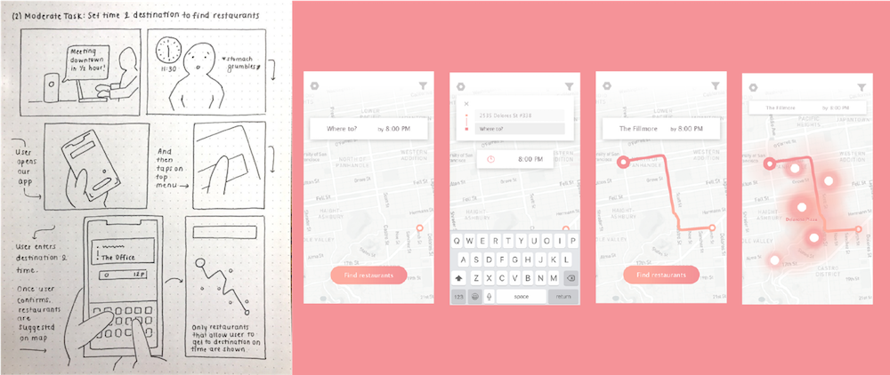

<a href="https://www2.eecs.berkeley.edu/Courses/CS160/" target="_blank" class="cycle">CS 160</a>
is UC Berkeley’s course in User Interface Design & Development. I took the course in Spring 2018 because of my passion for interaction-driven engineering. The class was divided into teams which each developed an Android application from the ground up, starting with brainstorming and then moving through the iterative design process of sketching, prototyping, UER development, user testing, and production. I enjoyed CS 160 so much that I am now a GSI on the course staff for Fall 2018!

My team developed an Android app called Dinestination, an application that determines the best place for a user to eat based on time constraints and target destination. Feel free to check out our <a href="https://github.com/adrianababakanian/busybears" target="_blank" class="cycle">source code</a> and <a href="https://youtu.be/id0EGZajkS4" target="_blank" class="cycle">final project video</a>!

In this section I focus on detailing my design process behind the visual interface development. For technical details regarding my implementation process, please see the programming section of my site here!

## Brainstorming

Each semester of CS 160 is defined by a theme that drives the types of applications developed. Spring 2018’s theme was “integrating the digital and physical worlds.” Our first task as a team was to brainstorm a minimum of fifty ideas for apps that would meet this criteria. We took inspiration from
<a href="https://www.ideo.com/" target="_blank" class="cycle">IDEO</a>'s rules of brainstorming and thus ended up with a massive range of ideas in the span of just an hour.

After detailing each of these ideas by enumerating their goals and target users, we chose 10 that we liked the most and created rough sketches to capture the desired interaction. We also performed competitive analysis to ensure that we were not duplicating something that already existed in the user’s market. Take a look at the <a href="https://paper.dropbox.com/doc/CS-160-Brainstorm--ALu8YfA5ho9IG4RRFwFbbqulAg-iwbtVyGxBnCmgQGNdAtDM" target="_blank" class="cycle">results of our initial brainstorming</a>!

## Problem & Solution Overview

When a user is on their way to a specific destination under a time constraint, it is difficult to find a place to eat along the way that will both get them there on time and meet any filtering criteria the user might have. This process of finding a route-friendly place to eat currently involves a fragmented workflow across a discrete series of apps and search engine queries — rendering the logic of the current flow far too linear for the desired use case. Given that the task of finding a place to eat along the route to a destination is inherently linked to the task of navigating there, it logically follows that these tasks mesh into the same interface.

We are targeting people who have a place to be at by a specific time and need to get something to eat along the way.

Our solution was to create a single flow for finding a place to eat that won’t make you late.

## Contextual Inquiry

One of CS 160’s primary motivations as a course is to hone the skills of design and development for defined target user groups outside of one’s own user space. That is, practicing the ability to design for a user and not for oneself. As such, we performed contextual inquiry by defining a specific target user and determining the goals they need to meet by observing them in their task-based environment. ____’s article on contextual inquiry and task analysis provides wonderful insight into the “master-apprentice” techniques that leads to meaningful user insights as opposed to artificial results that usually result from interviews conducted in a traditional setting.

We defined our target users as people who are on their way to a specific destination under a time constraint and need to get something to eat along the way. Check out the detailed results of our contextual inquiry and task analysis process here!

We conducted inquiries with target users each on their way to a location and needed to grab something to eat along the way, but all in different contexts.

Based on our user inquiries, we found that the average user will likely use some combination of Yelp searching, Googling, opening navigation apps, and more to achieve their goal. This manual searching is a limiting factor in both efficiency and range of discoverable restaurants. We found that users tended to search for restaurants only around their start and end locations, thus missing out on a wide range of options along the route. This behavior is nonetheless understandable given the linear nature of the current workflow — this mental balancing act across apps requires keeping track of a lot of information in order to gather the information necessary to make a decision.

## Task Analysis

We investigated a series of task analysis questions in order to drive the development of our interface — by considering tasks performed by the target user, we were able to optimize our interface for the user’s needs. This task-driven design methodology lead us to create the following distillation of tasks that the UI should support, parameterized by levels of complexity:

#### Easy
* &rarr; Find restaurants nearby with short wait times. If users sets destination as their current location or very close to it, the interface will provide restaurants nearby sorted in order of shortest wait time. So if a user wanted to use this app when they are already at the location they need to be at, they do not necessarily have to find restaurants along a path. This will allow them to still find restaurants and their wait times, but just in their vicinity.
* &rarr; (See detailed description with Interface Design) Ability to filter restaurant options by dietary restrictions/preferences/price. This filtering is very simple but powerful and can be applied to many situations — suppose the user is craving a certain type of cuisine, or is going out with a group of people who need vegan options on the menu. This helps the user further narrow down restaurants easily, without having to explore each option and mentally cross them out. It also helps in not querying excess information to the user and distracting them when they are trying to quickly choose a place to eat.

#### Moderate
* &rarr; (See detailed description with Interface Design) Set destination you’re heading to and the time you need to be there in order to get suggestions about where to eat along the way. This task will combine the estimated wait time on top of trip time to provide a better judgment of whether or not to select a specific restaurant to dine at. This helps the user plan their time and will automatically suggest restaurants that will fit into their schedule once an arrival time is set.
* &rarr; Allowing users to set a departure time in the future to plan their schedule in advance. For example, the user is planning on going to a concert later that night and wants to start planning their day in the morning, so they can set the time they estimate they will be departing for dinner. This task will pull information about wait times based off the departure time the user specified.

#### Difficult
* &rarr; (See detailed description with Interface Design) User wants to see details of a restaurant suggested by the app via the heatmap, such as its rating, the actual wait time, etc. This task entails selecting a restaurant suggested on the heatmap and learning more about it. It will also provide users with the ability to be more informed about the restaurant other than just its name, distance, and wait time, so the user will not have to rely on another app to find more information.
* &rarr; Incorporating take-out orders synchronized with when you should go to pick up the food. The user will input what time they are leaving by, and the app will suggest to them when to order their food. Otherwise, the user will order food, and the app will suggest to them when they should leave by. If the user tries to order food in a not timely manner, the app will warn them.
* &rarr; Smart calendar integration and notifications to help busy users manage their days.
* &rarr; Crowdsource data from users regarding the accuracy of wait times to improve our algorithms.

#### Extreme
* &rarr; Integrate service with hardware, for example - coordinating your route with a Kiwi robot delivery.

Ultimately, after the contextual inquiry and task analysis processes we defined the following key tasks for our interface to be required to optimally perform:

* &rarr; Find restaurants based on the user’s time and destination constraints.
* &rarr; Filtering restaurant results by user preferences.
* &rarr; Select a restaurant to navigate to from the heatmap based on restaurant details.

## Competitive Analysis
We performed in-depth analysis of both direct and indirect competitors to inform our understanding of the target user’s needs, gain familiarity with the existing market, and determine both strengths and points of improvement for existing solutions. Take a look at the <a href="https://paper.dropbox.com/doc/Contextual-Inquiry-Task-Analysis-Competitive-Analysis--ALuXAoZ6pRhPtNdlQ5wv3jLgAg-pgCTA8208BeAzDLTtF6G9/" target="_blank" class="cycle">detailed results of our analysis</a>! We made an effort to include competitors that are not just Android applications — doing so allowed us to think outside of the box of mobile app development.  Competitors included Google Maps, Google Popular Times, Yelp, Nowait, Waitly, OpenTable, Soylent, Postmates, drive-through fast food, and Uber.

The aforementioned competitors have “solved” the problems of eating in a hurry, getting to a destination, and finding nearby restaurants individually, but none of them compile this information effectively.  Most of our interviewees currently use a combination of several applications to achieve this task (e.g. Google Maps, Nowait, and Yelp), and even then, they aren’t getting the added features of incorporating a destination arrival time into the equation, or coordinating take-out.

## Low Fidelity Prototype
I started the low fidelity prototyping process by storyboarding task scenarios of varying levels of complexity. Each of the storyboards below is accompanied by initial mocks of the screens required to perform the tasks in the storyboard.

* &rarr; Easy Task: Filtering restaurant results

* &rarr; Moderate Task: Set time & destination to find restaurant

* &rarr; Difficult task: Analyze restaurant details

I then made an interactive Invision prototype, which we put together into a <a href="https://www.dropbox.com/s/20s9httalqkfodu/160Vid.mp4?dl=0" target="_blank" class="cycle">video</a> showcasing the prototype performing in its target use case.

## User Experience Research
I conducted user experience research on an interactive Invision prototype of the low fidelity mocks in order to inform the next stages of my design process. This research allowed me to identify usability impediments and disparities between the intended interaction flow and the way in which target users interacted with the prototype.
Our test method was primarily defined by choosing participants that defined a wide spectrum of target destinations and time restrictions. We presented users with the three key tasks mentioned previously in order to drive the testing interaction, and at the end of the test asked them the following questions:

* &rarr; What is your first instinct when you saw the home screen?
* &rarr; What do you think of the whole process of the app (From home screen to routing to the restaurant)? Do you think it flowed well or were there some parts you felt tripped up on? (restaurants or filters first?)
* &rarr; Did the app respond as you expected?
* &rarr; What task did you have trouble with or what task could be made easier?
* &rarr; What do you like best about the app/what did you dislike the most?
* &rarr; Did you expect the app to perform any actions that it didn’t?
* &rarr; Are there any other tasks you would like to add to the app to make the process easier or more complete?

Below is a summary of the UER results that informed the next stages of design iteration, both positive and negative. My solutions to these usability issues are detailed here in the high fidelity prototype section.

* &rarr; Lack of clarity in the first step that should be taken — users almost universally clicked on the “find restaurants” button initially before entering an end destination.
* &rarr; Dislike of the color scheme and visual design.
* &rarr; Users noted that the app felt generally familiar and intuitive.
* &rarr; The filtering task was difficult due to the lack of visibility of the filter button.
* &rarr; No way of noting the the filters had been applied once looking for restaurants.
* &rarr; Confusion about where to click once a destination had been entered.
* &rarr; Unexpected behavior of defaulting to ridesharing (Uber) when selecting the “Route me” button

## High Fidelity Prototype
My iterations from low fidelity to high fidelity prototype were informed by the results of my user experience research as detailed above. Priority was assigned to re-designs that minimized the user’s gulfs of execution and evaluation — that is, iterating upon the design in order to match the user’s expectations of how the system should respond to their interactions. You can check out the evolution points below, our
<a href="https://docs.google.com/presentation/d/1wGbCuoasUhY5VAoaSJaGSB7ZcSgSKTjhLn_0XNrSA-4/edit" target="_blank" class="cycle">mid-semester critique slide deck</a> and the
<a href="https://projects.invisionapp.com/share/WJG4MRC5FN6#/screens/284576440_Main_Screen" target="_blank" class="cycle">finalized Invision prototype</a>!

The comparisons below show the low-fidelity screens on the left, and screenshots of the corresponding screens in the final implemented interface.

#### Key evolution points:

* __&rarr; Misleading signifiers removed from interface__.
  * &#8702; I removed the “find restaurants” button from the main screen and then display it conditionally only once the user has input their required logistics. This decision is consistent both with the aforementioned user research results and Hicks’ Law, which states that the time it takes for a user to make a decision increases with the number of options presented to said user.

  
* __&rarr; Resolved lack of clarity in how to navigate to desired restaurant once determined__.
  * &#8702; I initially used a check mark icon as a means of “selecting” a restaurant to navigate to. However, users were not able to intuitively understand this visually, so I changed to the standard Google directions icon. This change both increased familiarity and conformed to standard Android UI patterns.

  
* __&rarr; Filter button moved to be more integrated into the main interaction__.
  * &#8702; In the low fidelity prototype, applying preference filters was entirely removed from the process of inputing the target destination, and several users did not even notice the filtering functionality. As such, I integrated the filter button into the destination input section so as to connect the two processes. I also changed the button from an icon to a text button to conform with Android UI patterns, and changed the filter icon to a slider bar similar to the one used by Yelp in order to make it recognizable to the target user.

  

  
* __&rarr; Added signifiers to visually reinforce successful filter application__.
  * &#8702; My first interaction mocks signified successful filter application via an awkward confirmation popup that disappeared after returning to the map. This need for a textual label to communicate the system status to the user indicated a need for clearer signifiers and a relocation of the functionality within the flow. To address this lack of visibility of system status, I added the applied filters to a scroll bar persistent at the top of the interface.

  
* __&rarr; Visual design evolution to a more dynamic color palette and removing unwanted visual associations__.
  * &#8702; The visual design evolution was primarily characterized by a transformation to Android UI standards and a change in color palette. The deep pink color palette used initially ended up looking slightly pathological when applied to the heatmap, so I transitioned to a more visually dynamic color palette of vibrant blues and greens. This decision both eliminated unwanted visual associations and created a more dynamic contrast against the cool muted map background.

  
* __&rarr; Lack of flexibility in choosing how to navigate__.
  * &#8702; Added transportation options (driving, walking, biking, ridesharing) to the map once destination has been entered so that the user can select between the different options and see how the resulting route based on the type of transportation selected.

  

## Takeaways
This highly informed iterative design process supported by contextual inquiry, task analysis, user experience research, and studio reviews really taught me a lot about what it takes to design a highly effective interface optimized for tasks required by the target user.
