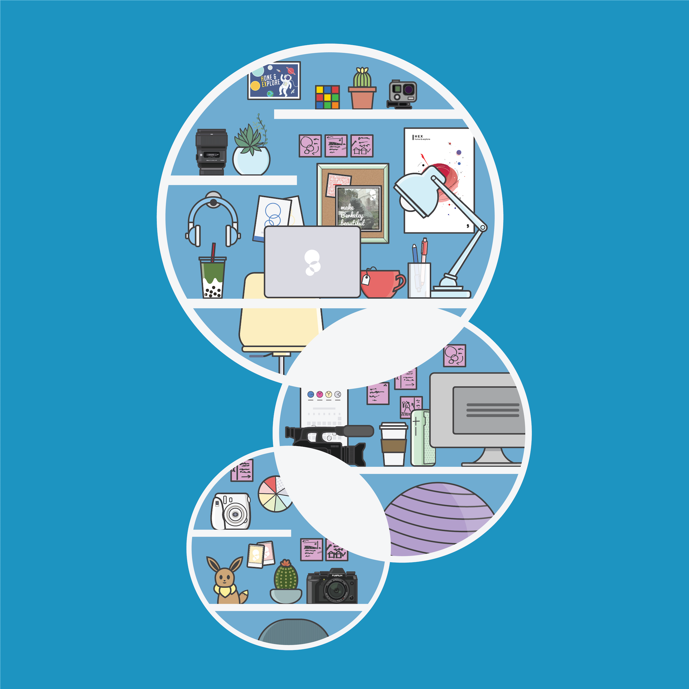
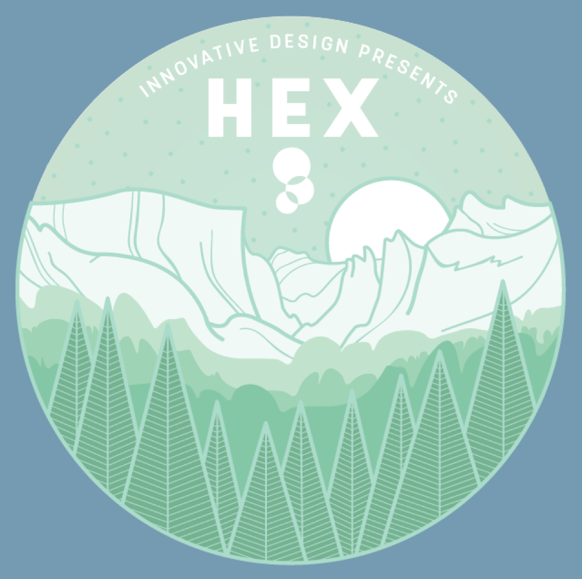
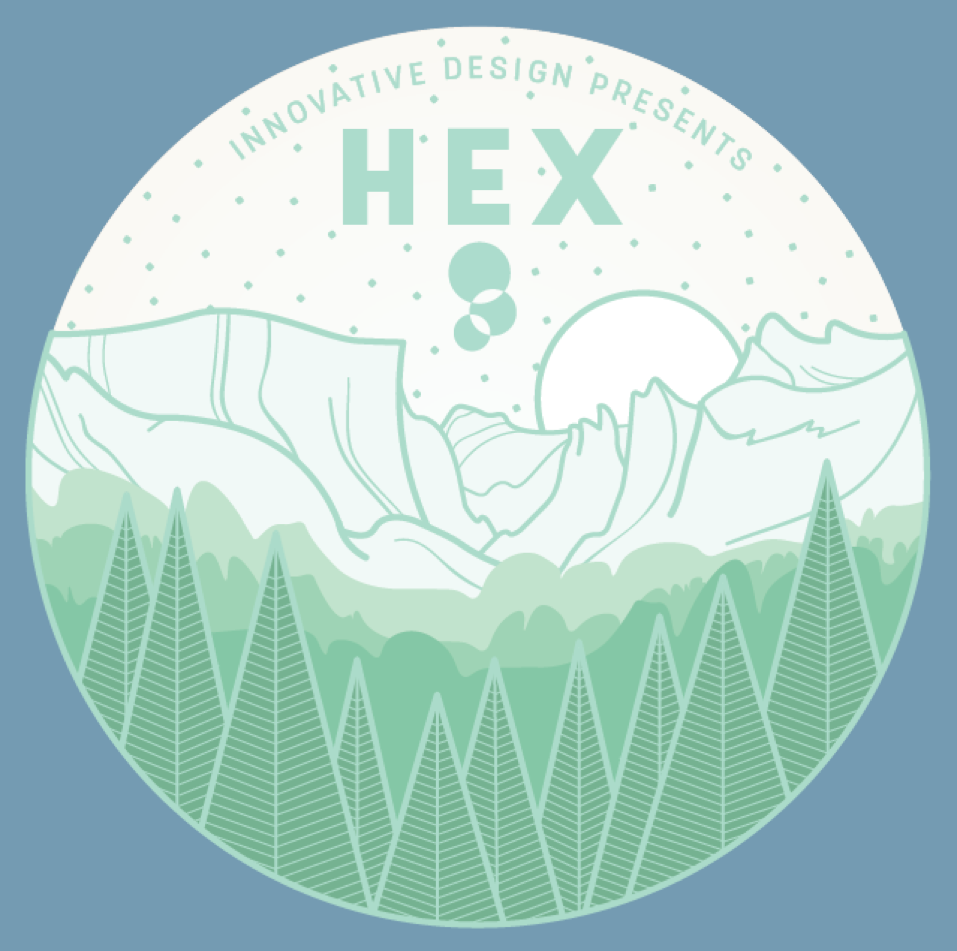

<a href="https://innovativedesign.club/" target="_blank" class="cycle">Innovative Design</a>
is Berkeley's premier student-run creative agency. We do graphic design work, photography, web development, and more for a wide array of both campus organizations and off-campus clientele. InnoD makes Berkeley beautiful, and Marketing Tier makes InnoD beautiful! I was on Marketing Tier for three consecutive semesters, where I helped ideate, develop, and execute marketing campaigns for InnoD's recruitment, campus events, and internal events.

Below are some of the assets I've made for InnoD over the past two years.  

  

  

  

  

  

  

  

  

  

