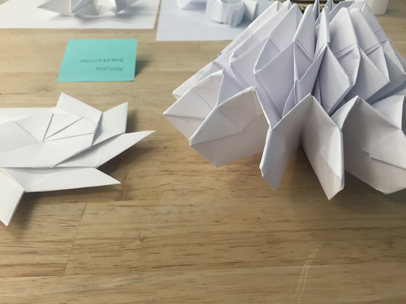

The artform of <a href="https://en.wikipedia.org/wiki/Kirigami" target="_blank" class="atomic">kirigami</a> is a variation of the traditional origami that allows cuts of the paper, as opposed to only folds. In this project, I intertwined the natural simplicity of kirigami with the electronics of a microcontoller using only fine thread as an intermediary in order to animate the delicate paper in motions resembling slight breadths.

I first experimented with different forms of kirigami to find a shape most conducive to resembling the pattern of inhalation and exhalation once animated.

To allow for the breathing motion, I threaded the edges of the kirigami together and then attached the ends to a motor. This motor was controlled by an Ardunio Uno programmed to simply provide and release tension cyclically, thus resulting in a breathing motion of the paper folds.

