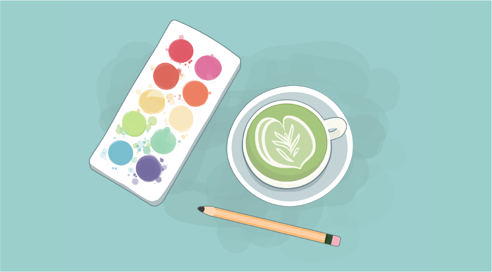
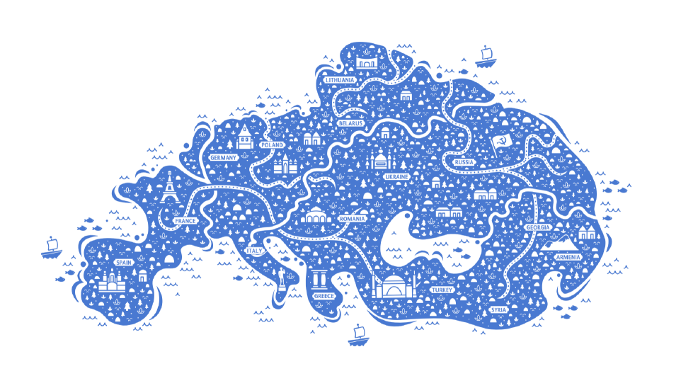

#### Illustration and visual design has always been a fun way for me to engage with the intersection of art and technology. I enjoy augmenting most forms of design with illustrative elements.

  

  

  

  

